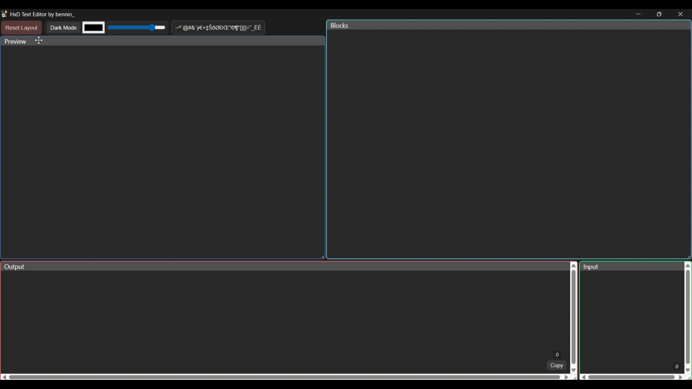
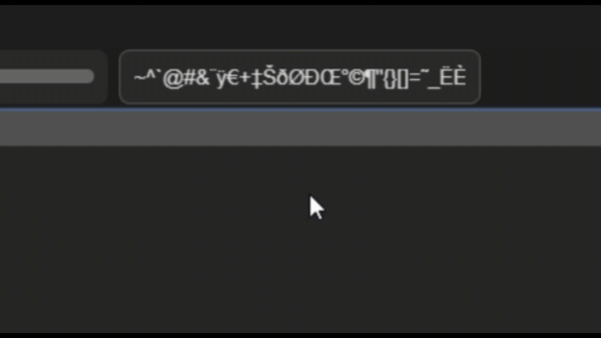
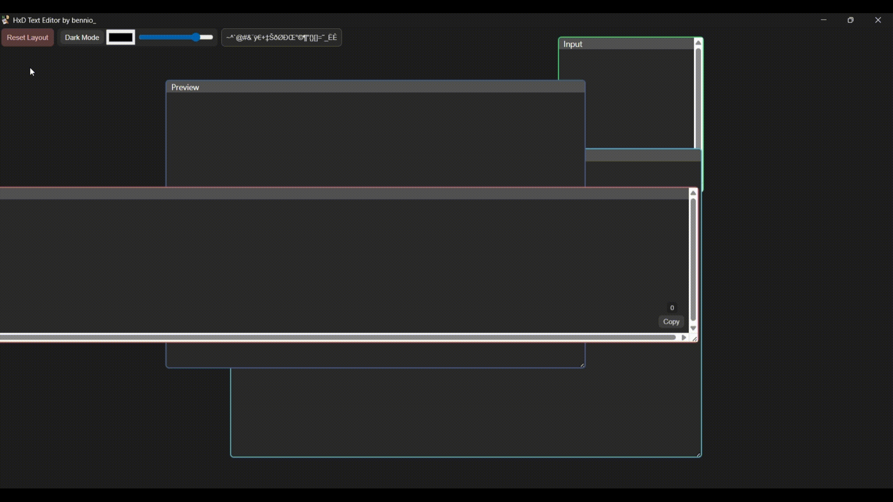

# Select your language:
- [English](#eng)
- [Português](#pt-br)
- [日本語](#jp)
- [Español](#esp)
- [中文(简体)](#ch)
---------------
# ENG

# **HxD Text Editor**

***HxD Text Editor*** is an open-source text editor designed for texts copied from the ***HxD*** program. The main purpose of this tool is to simplify and speed up the workflow of translating/correcting text in PS2 game ".iso" files, for example.

# **Main Features**:

* Separates text into blocks with a fixed character count, divided from the beginning of a LETTER or NUMBER in a segment until before another one begins with an empty character before it.

* Deleted characters are converted into empty spaces instead of being removed entirely. This keeps the segment the same size as the original (ideal for avoiding ISO corruption).
* Characters that are not useful and may clutter editing in the Blocks and Preview windows are hidden. They can be added or removed in the small box containing those characters, but they are still included in the Output.

# **UI Features**:

There are 4 main windows:

* **Input**: Used to insert the text that will be edited. It includes a small dynamic character counter if needed.

* **Preview**: Displays the segment divided into blocks without editing. Direct editing is not possible here; it only updates through the Input. It also contains dynamic counters for each block.

* **Blocks**: A window containing the divided text blocks, with individual editing and dynamic counters for each block.

* **Output**: Contains the edited text, including the hidden characters restored during editing, delivering the same character count as the Input (or at least it is supposed to). There is also a small button to copy the entire Output content, helping speed up the editing workflow.

**Other Elements**:

* **Reset Layout**: If you change the size and/or position of the windows, use this button to restore everything to default.

 
* **Dark/Light Mode**: Switches between light and dark interface modes, with Dark Mode enabled by default.

* **Customizable Theme**: Allows changing the main color used across most of the interface, enabling unique themes.

* **Transparency Control**: Lets you adjust the transparency of window backgrounds, available only for customizable themes.

* **Hidden/Forbidden Characters**: Allows changing which characters will or will not appear in the Blocks and Preview windows, simply by typing, copying, or pasting them.

# Technical Features:

* **Windows**: The windows are movable and resizable, with thin borders and characteristic colors. When transparency is enabled, they display a blurred background effect, creating a styled overlay appearance.
* **Editing**: Editing is based on replacing characters rather than deleting them.
  * The Backspace and Delete keys transform characters into empty ones (represented by a symbol inside the program, but displayed normally in HxD, similar to a period). Backspace replaces previous characters, while Delete replaces following characters.
  * Pressing Enter does not change the number of characters inside the Blocks (since after attempting to replace one, line breaks are removed and the cursor returns to the beginning of the segment).
  * Copy and paste functions work normally, only replacing characters according to the amount copied, while leaving the remaining characters unchanged.
  * Ctrl+Z and Ctrl+Y (undo and redo) are also supported, with a limit of up to 150 undo/redo actions.
  * Regular spaces are counted as part of a segment.
  * Segments have fixed sizes, preventing overflow into unrelated segments.
  * Only viewing the content of the Preview and Output windows is possible.
  * All character counters are dynamic, allowing users to check whether the original character count has changed.

* Aesthetics:

  * The **Dark/Light Mode** button changes the colors of the windows and background between black and white, optimized for visibility and visual comfort.
 

  * **Customizable Colors**: This button allows changing window and background colors to any RGB, HLS, or HEX color. It is also possible to pick any color directly from the screen using the eyedropper tool.

  * **Window Transparency**: A slider allows adjusting the transparency of window backgrounds, providing additional customization.

* **Forbidden Characters**: Characters hidden during block editing are managed in this area, where users can type (or paste) and remove any characters they want hidden while editing the Blocks. This keeps editing cleaner and avoids accidentally replacing important characters.

* The "**Reset Layout**" button restores all windows to their default size and position, undoing any modifications made by the user.

**Warning**: I am not responsible for improper use of this tool (if such misuse is even possible). Its intended purpose is to assist with editing text copied from the "HxD" program, making translation and correction workflows for ".iso" games more accessible.

Make good use of this tool and feel free to leave your feedback in the comments, or preferably through my email for such purposes: [bennio23@proton.me](mailto:bennio23@proton.me).

Thank you in advance :)

------------------------

# PT-BR

# **HxD Text Editor**

***HxD Text Editor*** é um editor de texto open-source desenvolvido para textos copiados do programa ***HxD***. O principal objetivo desta ferramenta é simplificar e acelerar o fluxo de trabalho de tradução/correção de textos em arquivos ".iso" de jogos de PS2, por exemplo.

# **Principais Recursos**:

* Separa o texto em blocos com uma quantidade fixa de caracteres, divididos desde o início de uma LETRA ou NÚMERO em um segmento até antes de outro começar com um caractere vazio antes dele.

* Caracteres apagados são convertidos em espaços vazios em vez de serem removidos completamente. Isso mantém o segmento com o mesmo tamanho do original (ideal para evitar corrupção da ISO).
* Caracteres que não são úteis e podem poluir a edição nas janelas de Blocks e Preview ficam ocultos. Eles podem ser adicionados ou removidos na pequena caixa que contém esses caracteres, mas continuam incluídos no Output.

# **Recursos da Interface**:

Existem 4 janelas principais:

* **Input**: Usada para inserir o texto que será editado. Inclui um pequeno contador dinâmico de caracteres, caso necessário.

* **Preview**: Exibe o segmento dividido em blocos sem edição. Não é possível editar diretamente aqui; ele apenas é atualizado através do Input. Também contém contadores dinâmicos para cada bloco.

* **Blocks**: Uma janela contendo os blocos de texto divididos, com edição individual e contadores dinâmicos para cada bloco.

* **Output**: Contém o texto editado, incluindo os caracteres ocultos restaurados durante a edição, entregando a mesma quantidade de caracteres do Input (ou pelo menos é o que deveria acontecer). Também há um pequeno botão para copiar todo o conteúdo do Output, ajudando a acelerar o fluxo de edição.

**Outros Elementos**:

* **Reset Layout**: Caso você altere o tamanho e/ou posição das janelas, use este botão para restaurar tudo ao padrão.

* **Dark/Light Mode**: Alterna entre os modos claro e escuro da interface, com o Dark Mode ativado por padrão.

* **Tema Personalizável**: Permite alterar a cor principal usada na maior parte da interface, possibilitando temas únicos.

* **Controle de Transparência**: Permite ajustar a transparência do fundo das janelas, disponível apenas para temas personalizáveis.

* **Caracteres Ocultos/Proibidos**: Permite alterar quais caracteres irão ou não aparecer nas janelas Blocks e Preview, apenas digitando, copiando ou colando-os.

# Recursos Técnicos:

* **Janelas**: As janelas são móveis e redimensionáveis, com bordas finas e cores características. Quando a transparência está ativada, exibem um efeito de fundo desfocado, criando uma aparência de overlay estilizada.

* **Edição**: A edição é baseada na substituição de caracteres em vez da remoção deles.

  * As teclas Backspace e Delete transformam caracteres em vazios (representados por um símbolo dentro do programa, mas exibidos normalmente no HxD, semelhante a um ponto). O Backspace substitui caracteres anteriores, enquanto o Delete substitui os seguintes.
  * Pressionar Enter não altera a quantidade de caracteres dentro dos Blocks (já que, após tentar substituir um, as quebras de linha são removidas e o cursor retorna ao início do segmento).
  * As funções de copiar e colar funcionam normalmente, apenas substituindo caracteres de acordo com a quantidade copiada, enquanto os caracteres restantes permanecem inalterados.
  * Ctrl+Z e Ctrl+Y (desfazer e refazer) também são suportados, com limite de até 150 ações de desfazer/refazer.
  * Espaços comuns são contados como parte de um segmento.
  * Os segmentos possuem tamanhos fixos, impedindo overflow para segmentos não relacionados.
  * Apenas a visualização do conteúdo das janelas Preview e Output é possível.
  * Todos os contadores de caracteres são dinâmicos, permitindo verificar se a quantidade original de caracteres foi alterada.

* Estética:

  * O botão **Dark/Light Mode** altera as cores das janelas e do fundo entre preto e branco, otimizado para visibilidade e conforto visual.

* **Cores Personalizáveis**: Este botão permite alterar as cores das janelas e do fundo para qualquer cor RGB, HLS ou HEX. Também é possível selecionar qualquer cor diretamente da tela usando a ferramenta conta-gotas.

* **Transparência das Janelas**: Um slider permite ajustar a transparência do fundo das janelas, oferecendo personalização adicional.

* **Caracteres Proibidos**: Os caracteres ocultados durante a edição dos blocos são gerenciados nesta área, onde os usuários podem digitar (ou colar) e remover quaisquer caracteres que desejarem ocultar durante a edição dos Blocks. Isso mantém a edição mais limpa e evita substituir caracteres importantes acidentalmente.

* O botão "**Reset Layout**" restaura todas as janelas para o tamanho e posição padrão, desfazendo quaisquer modificações feitas pelo usuário.

**Aviso**: Não me responsabilizo pelo uso inadequado desta ferramenta (caso isso sequer seja possível). Seu propósito é auxiliar na edição de textos copiados do programa "HxD", tornando mais acessível o fluxo de tradução e correção de jogos ".iso".

Faça bom uso desta ferramenta e fique à vontade para deixar seu feedback nos comentários, ou preferencialmente através do meu email para esse tipo de finalidade: [bennio23@proton.me](mailto:bennio23@proton.me).

Agradeço desde já :)

--------------------------------------

# JP

# **HxD Text Editor**

***HxD Text Editor*** は、***HxD*** プログラムからコピーしたテキスト向けに開発されたオープンソースのテキストエディターです。主な目的は、PS2ゲームの「.iso」ファイル内テキストの翻訳・修正作業をより簡単かつ高速にすることです。

# **主な機能**:

* テキストを固定文字数のブロックに分割します。分割は、セグメント内の文字または数字の開始位置から、空白文字を挟んだ次の文字または数字が始まる直前まで行われます。

* 削除された文字は完全に消去されず、空白文字へ変換されます。これにより、元のセグメントと同じサイズを維持できます（ISO破損防止に最適です）。
* Blocks および Preview ウィンドウで編集の邪魔になる不要な文字は非表示になります。これらの文字は専用の小さなボックスで追加・削除できますが、Output には引き続き含まれます。

# **UI機能**:

主なウィンドウは4つあります:

* **Input**: 編集するテキストを入力するためのウィンドウです。必要に応じて、動的な文字数カウンターが表示されます。

* **Preview**: 編集前のセグメントをブロック分割した状態で表示します。ここで直接編集することはできず、Input を通じてのみ更新されます。また、各ブロックごとの動的カウンターも表示されます。

* **Blocks**: 分割されたテキストブロックを含むウィンドウで、各ブロックを個別に編集できます。各ブロックには動的カウンターもあります。

* **Output**: 編集後のテキストを表示します。編集中に隠されていた文字も復元され、Input と同じ文字数を維持します（少なくともそのように動作するはずです）。また、Output 全体をコピーするための小さなボタンもあり、編集作業を効率化できます。

**その他の要素**:

* **Reset Layout**: ウィンドウのサイズや位置を変更した場合、このボタンでデフォルト状態に戻せます。

* **Dark/Light Mode**: ライトモードとダークモードを切り替えます。デフォルトではダークモードが有効です。

* **Customizable Theme**: インターフェース全体で使用されるメインカラーを変更し、独自テーマを作成できます。

* **Transparency Control**: ウィンドウ背景の透明度を調整できます。カスタムテーマ使用時のみ利用可能です。

* **Hidden/Forbidden Characters**: Blocks および Preview ウィンドウに表示・非表示にする文字を、入力・コピー・貼り付けによって変更できます。

# 技術的機能:

* **ウィンドウ**: ウィンドウは移動・リサイズ可能で、細い境界線と特徴的な色を備えています。透明度が有効な場合、背景ぼかし効果が適用され、スタイリッシュなオーバーレイ風デザインになります。

* **編集**: 編集は文字削除ではなく、文字置換ベースで行われます。

  * Backspace と Delete キーは文字を空白文字へ変換します（プログラム内では記号として表示されますが、HxD 上では通常表示され、ピリオドに似ています）。Backspace は前の文字を、Delete は後ろの文字を置き換えます。
  * Enter キーを押しても Blocks 内の文字数は変化しません（改行を試みた後、改行は削除され、カーソルはセグメント先頭へ戻ります）。
  * コピー＆ペーストは通常通り動作し、貼り付けた文字数分だけ置換が行われ、残りの文字は維持されます。
  * Ctrl+Z と Ctrl+Y（Undo / Redo）にも対応しており、最大150回までの操作履歴を保持します。
  * 通常のスペースもセグメントの一部としてカウントされます。
  * セグメントは固定サイズで、他の無関係なセグメントへのオーバーフローを防ぎます。
  * Preview と Output ウィンドウは閲覧専用です。
  * すべての文字数カウンターは動的で、元の文字数が変更されたか確認できます。

* デザイン:

  * **Dark/Light Mode** ボタンは、ウィンドウと背景色を黒・白で切り替え、視認性と快適性を向上させます。

* **Customizable Colors**: ウィンドウや背景色を RGB、HLS、HEX の任意カラーへ変更できます。また、スポイトツールを使って画面上の色を直接取得することも可能です。

* **Window Transparency**: スライダーによってウィンドウ背景の透明度を調整でき、さらなるカスタマイズが可能です。

* **Forbidden Characters**: ブロック編集時に隠される文字はこのエリアで管理されます。ユーザーは、Blocks 編集中に非表示にしたい文字を入力（または貼り付け）・削除できます。これにより編集画面を整理し、重要な文字を誤って置換するのを防げます。

* "**Reset Layout**" ボタンは、すべてのウィンドウをデフォルトのサイズと位置に戻し、ユーザーが行った変更をリセットします。

**注意**: 本ツールの不適切な使用について、私は責任を負いません（そもそも不適切な使用が可能かどうかは分かりませんが）。このツールの目的は、「HxD」プログラムからコピーしたテキスト編集を支援し、「.iso」ゲームの翻訳・修正作業をより手軽にすることです。

ぜひご活用ください。フィードバックはコメント欄、または可能であれば以下のメールアドレスまでお願いします: [bennio23@proton.me](mailto:bennio23@proton.me)

よろしくお願いします :)

--------------------------------

# ESP

# **HxD Text Editor**

***HxD Text Editor*** es un editor de texto de código abierto diseñado para textos copiados del programa ***HxD***. El objetivo principal de esta herramienta es simplificar y acelerar el flujo de trabajo de traducción/corrección de textos en archivos ".iso" de juegos de PS2, por ejemplo.

# **Características Principales**:

* Separa el texto en bloques con una cantidad fija de caracteres, divididos desde el inicio de una LETRA o NÚMERO en un segmento hasta antes de que otro comience con un carácter vacío antes de él.

* Los caracteres eliminados se convierten en espacios vacíos en lugar de eliminarse completamente. Esto mantiene el segmento con el mismo tamaño que el original (ideal para evitar corrupción de la ISO).
* Los caracteres que no son útiles y pueden dificultar la edición en las ventanas Blocks y Preview se ocultan. Estos pueden agregarse o eliminarse en la pequeña caja que contiene dichos caracteres, pero siguen incluidos en el Output.

# **Funciones de la Interfaz**:

Existen 4 ventanas principales:

* **Input**: Se utiliza para insertar el texto que será editado. Incluye un pequeño contador dinámico de caracteres si es necesario.

* **Preview**: Muestra el segmento dividido en bloques sin edición. No es posible editar directamente aquí; solo se actualiza a través del Input. También contiene contadores dinámicos para cada bloque.

* **Blocks**: Una ventana que contiene los bloques de texto divididos, con edición individual y contadores dinámicos para cada bloque.

* **Output**: Contiene el texto editado, incluyendo los caracteres ocultos restaurados durante la edición, entregando la misma cantidad de caracteres que el Input (o al menos eso se supone). También hay un pequeño botón para copiar todo el contenido del Output, ayudando a acelerar el flujo de edición.

**Otros Elementos**:

* **Reset Layout**: Si cambias el tamaño y/o posición de las ventanas, utiliza este botón para restaurar todo al estado predeterminado.

* **Dark/Light Mode**: Cambia entre los modos claro y oscuro de la interfaz, con el modo oscuro activado por defecto.

* **Tema Personalizable**: Permite cambiar el color principal utilizado en la mayor parte de la interfaz, posibilitando temas únicos.

* **Control de Transparencia**: Permite ajustar la transparencia del fondo de las ventanas, disponible solo para temas personalizables.

* **Caracteres Ocultos/Prohibidos**: Permite cambiar qué caracteres aparecerán o no en las ventanas Blocks y Preview, simplemente escribiéndolos, copiándolos o pegándolos.

# Características Técnicas:

* **Ventanas**: Las ventanas son movibles y redimensionables, con bordes finos y colores característicos. Cuando la transparencia está habilitada, muestran un efecto de fondo desenfocado, creando una apariencia estilizada tipo overlay.

* **Edición**: La edición se basa en reemplazar caracteres en lugar de eliminarlos.

  * Las teclas Backspace y Delete transforman los caracteres en vacíos (representados por un símbolo dentro del programa, pero mostrados normalmente en HxD, similar a un punto). Backspace reemplaza caracteres anteriores, mientras que Delete reemplaza caracteres posteriores.
  * Presionar Enter no cambia la cantidad de caracteres dentro de los Blocks (ya que, después de intentar reemplazar uno, los saltos de línea se eliminan y el cursor vuelve al inicio del segmento).
  * Las funciones de copiar y pegar funcionan normalmente, reemplazando caracteres de acuerdo con la cantidad copiada, mientras que los caracteres restantes permanecen sin cambios.
  * Ctrl+Z y Ctrl+Y (deshacer y rehacer) también son compatibles, con un límite de hasta 150 acciones.
  * Los espacios normales se cuentan como parte de un segmento.
  * Los segmentos tienen tamaños fijos, evitando desbordamientos hacia segmentos no relacionados.
  * Solo es posible visualizar el contenido de las ventanas Preview y Output.
  * Todos los contadores de caracteres son dinámicos, permitiendo verificar si la cantidad original de caracteres fue modificada.

* Estética:

  * El botón **Dark/Light Mode** cambia los colores de las ventanas y el fondo entre negro y blanco, optimizado para visibilidad y comodidad visual.

* **Colores Personalizables**: Este botón permite cambiar los colores de las ventanas y del fondo a cualquier color RGB, HLS o HEX. También es posible seleccionar cualquier color directamente desde la pantalla utilizando la herramienta cuentagotas.

* **Transparencia de las Ventanas**: Un control deslizante permite ajustar la transparencia del fondo de las ventanas, proporcionando personalización adicional.

* **Caracteres Prohibidos**: Los caracteres ocultos durante la edición de bloques se administran en esta área, donde los usuarios pueden escribir (o pegar) y eliminar cualquier carácter que deseen ocultar mientras editan los Blocks. Esto mantiene la edición más limpia y evita reemplazar accidentalmente caracteres importantes.

* El botón "**Reset Layout**" restaura todas las ventanas a su tamaño y posición predeterminados, deshaciendo cualquier modificación realizada por el usuario.

**Aviso**: No me responsabilizo por el uso indebido de esta herramienta (si es que tal uso indebido es posible). Su propósito es ayudar con la edición de textos copiados del programa "HxD", haciendo más accesible el flujo de traducción y corrección de juegos ".iso".

Haz buen uso de esta herramienta y siéntete libre de dejar tus comentarios, o preferiblemente enviarlos a mi correo electrónico para este tipo de asuntos: [bennio23@proton.me](mailto:bennio23@proton.me).

Gracias de antemano :)

-----------------------------------------

# CH

# **HxD Text Editor**

***HxD Text Editor*** 是一个开源文本编辑器，专门用于处理从 ***HxD*** 程序复制的文本。该工具的主要目的是简化并加快 PS2 游戏 “.iso” 文件中的文本翻译/修正工作流程。

# **主要功能**：

* 将文本分割为固定字符数量的区块，从一个段落中字母或数字的开头开始，直到下一个在空字符前开始的字母或数字之前结束。

* 被删除的字符不会被彻底移除，而是会转换为空字符。这样可以保持段落与原始大小一致（非常适合避免 ISO 损坏）。
* 在 Blocks 和 Preview 窗口中，对编辑没有帮助且可能造成干扰的字符会被隐藏。用户可以在包含这些字符的小框中添加或移除它们，但它们仍然会保留在 Output 中。

# **界面功能**：

共有 4 个主要窗口：

* **Input**：用于输入需要编辑的文本。如果需要，还会显示一个动态字符计数器。

* **Preview**：显示已分割为区块但尚未编辑的段落。无法直接在这里编辑；它只会通过 Input 更新。同时还包含每个区块的动态计数器。

* **Blocks**：包含已分割文本区块的窗口，支持单独编辑，并为每个区块提供动态计数器。

* **Output**：包含编辑后的文本，并恢复编辑过程中隐藏的字符，最终输出与 Input 相同的字符数量（至少理论上如此）。此外，还有一个小按钮可复制整个 Output 内容，以加快编辑流程。

**其他元素**：

* **Reset Layout**：如果更改了窗口大小和/或位置，可使用此按钮恢复默认布局。

* **Dark/Light Mode**：切换界面的深色/浅色模式，默认启用深色模式。

* **Customizable Theme**：允许更改界面大部分区域使用的主颜色，从而创建独特主题。

* **Transparency Control**：允许调整窗口背景透明度，仅适用于自定义主题。

* **Hidden/Forbidden Characters**：允许通过输入、复制或粘贴字符，自定义哪些字符会或不会显示在 Blocks 和 Preview 窗口中。

# 技术功能：

* **窗口**：窗口支持移动与调整大小，具有细边框和特色颜色。启用透明效果时，会显示模糊背景效果，形成具有风格化的覆盖层外观。

* **编辑**：编辑基于字符替换，而不是字符删除。

  * Backspace 和 Delete 键会将字符转换为空字符（在程序中以符号表示，但在 HxD 中会正常显示，类似于句点）。Backspace 替换前一个字符，而 Delete 替换后一个字符。
  * 按下 Enter 不会改变 Blocks 内的字符数量（因为尝试替换后，换行会被移除，光标会返回段落开头）。
  * 复制与粘贴功能正常工作，只会根据复制的字符数量进行替换，其余字符保持不变。
  * 支持 Ctrl+Z 和 Ctrl+Y（撤销/重做），最多支持 150 次撤销/重做操作。
  * 普通空格也会被计入段落的一部分。
  * 段落大小固定，防止溢出到无关段落。
  * Preview 和 Output 窗口仅支持查看内容。
  * 所有字符计数器都是动态的，可用于检查原始字符数量是否发生变化。

* 美观设计：

  * **Dark/Light Mode** 按钮可在黑白主题之间切换窗口和背景颜色，以优化可见性和视觉舒适度。

* **Customizable Colors**：此按钮允许将窗口和背景颜色更改为任意 RGB、HLS 或 HEX 颜色。同时还可以使用吸管工具直接从屏幕中选取颜色。

* **Window Transparency**：可通过滑块调整窗口背景透明度，提供额外的个性化设置。

* **Forbidden Characters**：在区块编辑期间被隐藏的字符会在此区域中管理，用户可以输入（或粘贴）并移除任何希望在编辑 Blocks 时隐藏的字符。这可以让编辑界面更加整洁，并避免误替换重要字符。

* “**Reset Layout**” 按钮会将所有窗口恢复到默认大小和位置，并撤销用户所做的修改。

**警告**：对于此工具的不当使用（如果真的存在这种可能），本人概不负责。该工具的目的是帮助编辑从 “HxD” 程序复制的文本，使 “.iso” 游戏的翻译与修正流程更加方便。

请合理使用此工具，并欢迎在评论区留下反馈，或者更推荐通过以下邮箱联系我： [bennio23@proton.me](mailto:bennio23@proton.me)

提前感谢 :)
