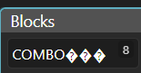
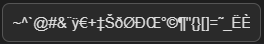
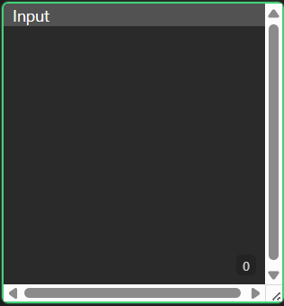
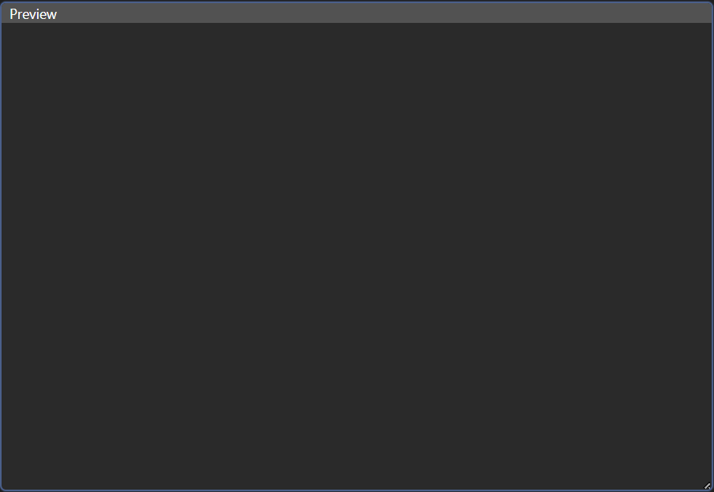
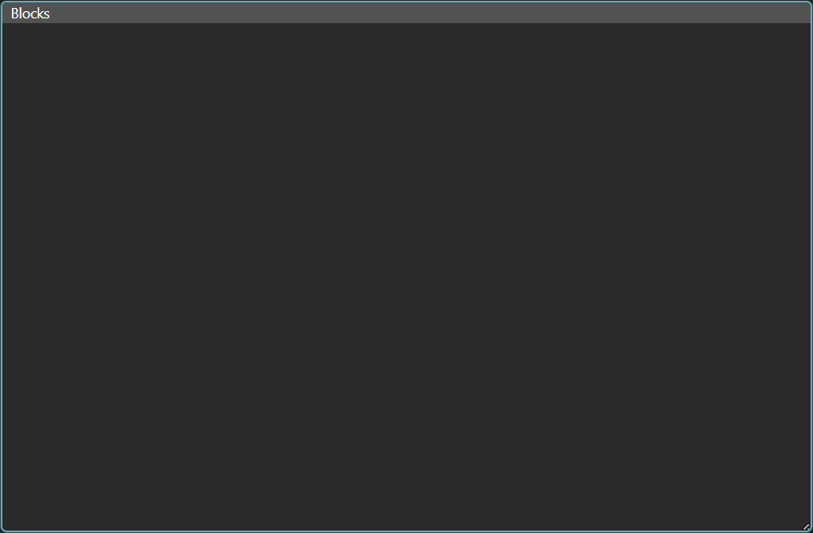
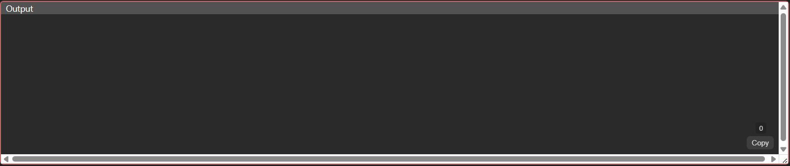
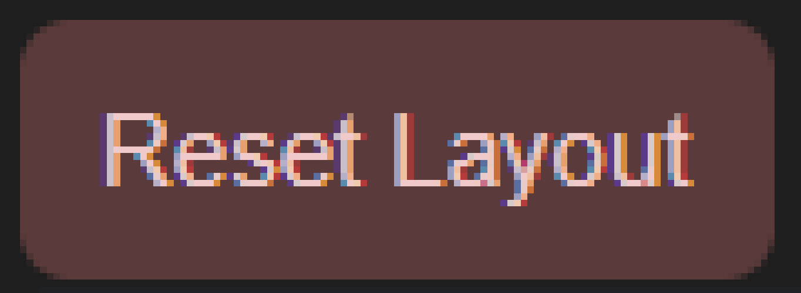
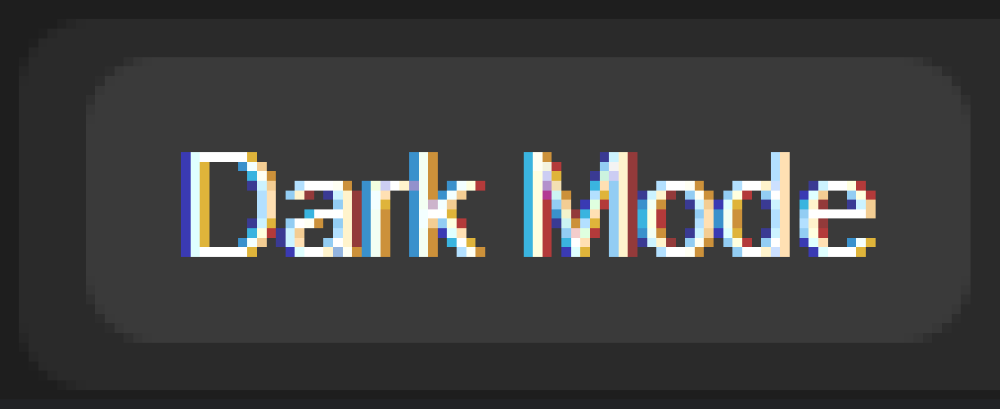
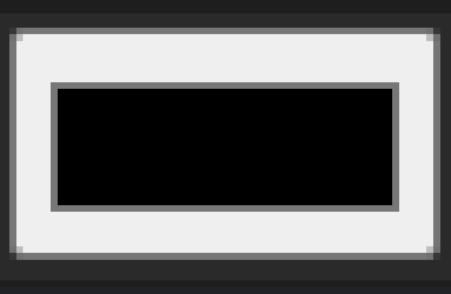
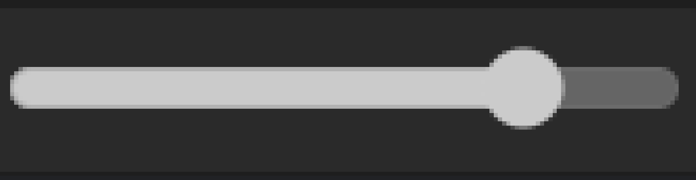

# Select your language:
- [English](#eng)
- [Português](#pt-br)
- [日本語](#jp)
- [Español](#esp)
- [中文(简体)](#ch)
---------------
# ENG

# HxD Text Editor

***HxD Text Editor*** is an open-source text editor designed for texts copied from the ***HxD*** program. The main purpose of this tool is to simplify and speed up the workflow of translating/correcting text in PS2 game ".iso" files, for example.

# Main Features:

* Separates text into blocks with a fixed character count, divided from the beginning of a LETTER or NUMBER in a segment until before another one begins with an empty character before it.

* Deleted characters are converted into empty spaces instead of being removed entirely. This keeps the segment the same size as the original (ideal for avoiding ISO corruption).
* Characters that are not useful and may clutter editing in the Blocks and Preview windows are hidden. They can be added or removed in the small box containing those characters, but they are still included in the Output.

# UI Features:

There are 4 main windows:

* Input: Used to insert the text that will be edited. It includes a small dynamic character counter if needed.

* Preview: Displays the segment divided into blocks without editing. Direct editing is not possible here; it only updates through the Input. It also contains dynamic counters for each block.

* Blocks: A window containing the divided text blocks, with individual editing and dynamic counters for each block.

* Output: Contains the edited text, including the hidden characters restored during editing, delivering the same character count as the Input (or at least it is supposed to). There is also a small button to copy the entire Output content, helping speed up the editing workflow.

Other Elements:

* Reset Layout: If you change the size and/or position of the windows, use this button to restore everything to default.

 
* Dark/Light Mode: Switches between light and dark interface modes, with Dark Mode enabled by default.

* Customizable Theme: Allows changing the main color used across most of the interface, enabling unique themes.

* Transparency Control: Lets you adjust the transparency of window backgrounds, available only for customizable themes.

* Hidden/Forbidden Characters: Allows changing which characters will or will not appear in the Blocks and Preview windows, simply by typing, copying, or pasting them.

# Technical Features:

* Windows: The windows are movable and resizable, with thin borders and characteristic colors. When transparency is enabled, they display a blurred background effect, creating a styled overlay appearance.
* Editing: Editing is based on replacing characters rather than deleting them.
  * The Backspace and Delete keys transform characters into empty ones (represented by a symbol inside the program, but displayed normally in HxD, similar to a period). Backspace replaces previous characters, while Delete replaces following characters.
  * Pressing Enter does not change the number of characters inside the Blocks (since after attempting to replace one, line breaks are removed and the cursor returns to the beginning of the segment).
  * Copy and paste functions work normally, only replacing characters according to the amount copied, while leaving the remaining characters unchanged.
  * Ctrl+Z and Ctrl+Y (undo and redo) are also supported, with a limit of up to 150 undo/redo actions.
  * Regular spaces are counted as part of a segment.
  * Segments have fixed sizes, preventing overflow into unrelated segments.
  * Only viewing the content of the Preview and Output windows is possible.
  * All character counters are dynamic, allowing users to check whether the original character count has changed.

* Aesthetics:

  * The Dark/Light Mode button changes the colors of the windows and background between black and white, optimized for visibility and visual comfort.
 

  * Customizable Colors: This button allows changing window and background colors to any RGB, HLS, or HEX color. It is also possible to pick any color directly from the screen using the eyedropper tool.

  * Window Transparency: A slider allows adjusting the transparency of window backgrounds, providing additional customization.

* Forbidden Characters: Characters hidden during block editing are managed in this area, where users can type (or paste) and remove any characters they want hidden while editing the Blocks. This keeps editing cleaner and avoids accidentally replacing important characters.

* The "Reset Layout" button restores all windows to their default size and position, undoing any modifications made by the user.

Warning: I am not responsible for improper use of this tool (if such misuse is even possible). Its intended purpose is to assist with editing text copied from the "HxD" program, making translation and correction workflows for ".iso" games more accessible.

Make good use of this tool and feel free to leave your feedback in the comments, or preferably through my email for such purposes: [bennio23@proton.me](mailto:bennio23@proton.me).

Thank you in advance :)

------------------------

# PT-BR

# HxD Text Editor

O **_HxD Text Editor_** é um editor de texto de código aberto, voltado para textos copiados do programa **_HxD_**. O principal propósito desta ferramenta é facilitar e acelerar o fluxo de traduções/correções de textos em arquivos ".iso" de jogos de PS2, por exemplo.

# Principais recursos:

- Separa o texto em blocos de quantidade fixa de caracteres, que são divididos pelo começo de uma LETRA ou NÚMERO do trecho até antes de começar outra que esteja com um caractere vazio antes.'
- Caracteres deletados são transformados nos espaços vazios, e não apagando o caractere em si. Assim, deixando o trecho do mesmo tamanho do original (ideal para não quebrar a iso).
- Caracteres que não são úteis e que podem poluir a edição na janela de Blocks e Preview são ocultos, podendo ser adicionados ou removidos na janelinha que tem vários caracteres desse tipo, mas são inclusos no Output.

# Características de UI:

Há 4 janelas principais:
- Input: Para inserir o texto que será editado. Há um pequeno contador dinâmico de caracteres, que pode ajudar, se precisar.
- Preview: Para visualizar o trecho dividido em blocos sem edição, não sendo possível editar diretamente, apenas se editado no Input, também há contadores dinâmicos, só que em cada bloco.
- Blocks: Consistindo em uma janela onde contém os blocos de textos divididos, com edição individual e contadores dinâmicos em cada bloco.
- Output: Nele fica o texto editado, já junto com os caracteres que foram ocultos na edição, entregando a mesma quantidade do Input (pelo menos é pra ser). Há um pequeno botão de copiar todo conteúdo do Output, pra acelerar o fluxo de edição.

Outros elementos:

- Reset Layout: Caso você tenha alterado o tamanho e/ou a posição das janelas, use esse botão pra voltar tudo ao padrão.
- Dark/Light Mode: Troca entre os modos claro e escuro da interface, sendo o Modo Escuro por padrão.
- Tema Customizável: Se trata de um simples modificação da cor principal da maior parte da interface, permitindo temas únicos.
- Controle de Transparência: permite alterar a transparência do fundo das janelas, apenas para temas customizáveis.
- Caracteres Ocultos/Proibidos: Permite alterar que caracteres aparecerão ou não nos Blocks e na Preview, apenas digitando ou copiando e colando.

# Recursos técnicos:

- Janelas: As janelas são móveis e redimensionáveis, contendo uma borda fina, tendo uma cor característica. Quando transparentes, elas apresentam um aspecto de blur no fundo, estilizando quando sobrepostas.
- Edição: A edição é feita com base no princípio de substituir o caractere, e não apagá-lo. 
  -Os botões Backspace e Delete tem a função de transformar o caractere em vazio (que tem esse símbolo no programa, mas no HxD vai estar normal, como se fosse um ponto final), sendo o Backspace pra substituir caracteres anteriores e Delete caracteres posteriores. 
  - O Enter não altera a quantidade de caracteres dentro do Blocks (visto que depois de tentar substituir um, os enters são removidos e o ponteiro volta para o início do trecho.).
  - As funções de copiar e colar funcionam, apenas substituindo caracteres na quantidade dos copiados, deixando os outros da mesma forma.
  - O ctrl+z e o ctrl+y (desfazer e refazer) também funciona, com um limite de até 150 ações de desfazer e refazer.
  - Os espaços normais são contabilizados como parte de um trecho.
  - Os trechos tem tamanhos fixos, evitando ultrapassar para outros trechos na qual ele não tem nada haver.
  - Apenas a visualização do conteúdo das janelas Preview e do Output é possível
  - Todos os contadores de caracteres são dinâmicos, permitindo saber se houve alteração na quantidade de caracteres originais.

- Estética:

  - O botão Dark/Light Mode alterna as cores das janelas e do fundo, para cores preta e branca, ajustado para conforto visual e visibilidade.
  - Cores Personalizáveis: Nesse botão, é possível alterar as cores das janelas e do fundo para qualquer cor em RGB, HLS ou HEX. É possível pegar qualquer cor da tela com o conta-gotas.
  - Transparência das janelas: Há um controle deslizante que permite ajustar a transparência do fundo das janelas, proporcionando mais customização para o usuário.
- Caracteres proibidos: Os caracteres que são ocultos na hora da edição nos blocos ficam nesse espaço, onde pode ser digitado (também colável) ou deletado quaisquer caracteres que você queira ocultar na hora de editar os Blocks, deixando uma manipulação mais limpa e sem se preocupar com caracteres importantes que possam ser substituídos sem querer.
- O botão "Reset layout" move e redimensiona as janelas para a posição e tamanho na qual já estavam por padrão, assim, reiniciando tais modificações feitas pelo usuário.

Aviso: Não me responsabilizo pelo uso indevido desta ferramenta (se é que pode ter algum uso indevido), sendo sua utilização voltada para a edição de textos copiados do programa "HxD", de forma facilitada para mais pessoas que queriam fazer traduções ou correções de jogos ".iso".

Faça bom uso dessa ferramenta e dê seu feedback sobre ele nos comentários, ou de preferência, no meu email para tais fins: bennio23@proton.me. 

Desde já, agradeço :)

--------------------------------------

# JP

# HxD Text Editor

***HxD Text Editor*** は、***HxD*** プログラムからコピーしたテキスト向けに作られたオープンソースのテキストエディタです。
このツールの主な目的は、PS2ゲームの「.iso」ファイル内のテキスト翻訳・修正作業を、より簡単かつ高速にすることです。

# 主な機能:

* テキストを固定文字数のブロックに分割します。各ブロックは、文字列内の「文字」または「数字」から始まり、その前に空文字を持つ別の文字や数字が始まる直前までを基準に区切られます。
* 削除された文字は完全に消去されるのではなく、空白文字へ変換されます。これにより、元のテキストと同じサイズを維持できます（ISO破損防止に最適です）。
* Blocks と Preview ウィンドウで編集を邪魔する不要な文字を非表示にできます。これらの文字は専用の小ウィンドウで追加・削除可能ですが、Output には含まれます。

# UIの特徴:

メインウィンドウは4つあります:

* Input: 編集するテキストを入力する場所です。必要に応じて使用できる小さな動的文字数カウンターがあります。
* Preview: テキストを分割済みブロックとして表示します。ここでは直接編集できず、Input を編集した内容のみが反映されます。各ブロックには動的文字数カウンターがあります。
* Blocks: 分割されたテキストブロックを表示するウィンドウです。各ブロックを個別編集でき、動的文字数カウンターもあります。
* Output: 編集後のテキストを表示します。編集時に隠されていた文字も含まれ、Input と同じ文字数を維持します（少なくともその仕様です）。編集作業を高速化するため、Output 全体をコピーする小さなボタンもあります。

その他の要素:

* Reset Layout: ウィンドウのサイズや位置を変更した場合、このボタンでデフォルト状態に戻せます。
* Dark/Light Mode: インターフェースをライトモードとダークモードで切り替えます。デフォルトはダークモードです。
* Customizable Theme: インターフェースの主要カラーを変更し、独自テーマを作成できます。
* Transparency Control: カスタムテーマ時に、ウィンドウ背景の透明度を調整できます。
* Hidden/Forbidden Characters: Blocks と Preview に表示・非表示にする文字を、入力やコピー＆ペーストで設定できます。

# 技術的特徴:

* ウィンドウ:

  * ウィンドウは移動・リサイズ可能で、細い境界線と特徴的な色を持っています。
  * 透明化時には背景にぼかし効果が適用され、重なった際にスタイリッシュな見た目になります。
* 編集:

  * 編集は「文字を削除する」のではなく、「置き換える」方式です。
  * Backspace と Delete キーは、文字を空文字へ変換します（プログラム内では特殊記号で表示されますが、HxD では通常の文字、例えばピリオドのように見えます）。

    * Backspace は前の文字を置換します。
    * Delete は後ろの文字を置換します。
  * Enter キーを押しても Blocks 内の文字数は変化しません（置換後、改行は削除され、カーソルはセグメント先頭へ戻ります）。
  * コピー＆ペースト機能も動作し、コピーした文字数分だけ置換され、それ以外は維持されます。
  * Ctrl+Z と Ctrl+Y（元に戻す / やり直し）にも対応しており、最大150回まで操作可能です。
  * 通常のスペースもセグメントの一部としてカウントされます。
  * 各セグメントは固定サイズで、他の無関係なセグメントへはみ出しません。
  * Preview と Output ウィンドウは閲覧専用です。
  * すべての文字数カウンターは動的で、元の文字数が変更されたか確認できます。
* デザイン:

  * Dark/Light Mode ボタンは、背景とウィンドウカラーを黒と白で切り替え、視認性と目の負担軽減を考慮しています。
  * カスタマイズ可能な色:

    * RGB、HLS、HEX の任意カラーに変更可能です。
    * スポイト機能で画面上の任意の色を取得できます。
  * ウィンドウ透明度:

    * スライダーで背景透明度を調整でき、より自由なカスタマイズが可能です。
* 禁止文字:

  * Blocks 編集時に非表示となる文字はこのエリアで管理できます。
  * 入力・貼り付け・削除によって自由に設定でき、誤って重要な文字を編集してしまうのを防ぎます。
* 「Reset Layout」ボタン:

  * ウィンドウを初期サイズ・初期位置へ戻し、ユーザーによる変更をリセットします。

注意:
このツールの不適切な使用について、私は一切責任を負いません（そもそも不適切な使い方が存在するかは分かりませんが）。
本ツールは、「HxD」プログラムからコピーしたテキスト編集を簡単にし、「.iso」ゲームの翻訳や修正をより多くの人が行いやすくする目的で作られています。

このツールをぜひ活用し、感想やフィードバックをコメント、またはできれば以下のメールアドレスまで送ってください:
[bennio23@proton.me](mailto:bennio23@proton.me).

あらかじめ感謝します :)

--------------------------------

# ESP

# HxD Text Editor

***HxD Text Editor*** es un editor de texto de código abierto, diseñado para textos copiados del programa ***HxD***. El principal propósito de esta herramienta es facilitar y acelerar el flujo de traducción/corrección de textos en archivos ".iso" de juegos de PS2, por ejemplo.

# Funciones principales:

* Separa el texto en bloques de una cantidad fija de caracteres, divididos desde el comienzo de una LETRA o NÚMERO del fragmento hasta antes de que comience otro que tenga un carácter vacío antes.
* Los caracteres eliminados se transforman en espacios vacíos en lugar de borrarse completamente. Así, el fragmento mantiene el mismo tamaño que el original (ideal para evitar dañar la ISO).
* Los caracteres que no son útiles y pueden ensuciar la edición en las ventanas Blocks y Preview se ocultan. Estos pueden añadirse o eliminarse en la pequeña ventana que contiene dichos caracteres, pero siguen incluidos en el Output.

# Características de la UI:

Hay 4 ventanas principales:

* Input: Para insertar el texto que será editado. Incluye un pequeño contador dinámico de caracteres, en caso de ser necesario.
* Preview: Permite visualizar el fragmento dividido en bloques sin edición. No es posible editar directamente aquí; solo se actualiza mediante el Input. También contiene contadores dinámicos en cada bloque.
* Blocks: Consiste en una ventana que contiene los bloques de texto divididos, con edición individual y contadores dinámicos en cada bloque.
* Output: Aquí se encuentra el texto editado, junto con los caracteres ocultos restaurados durante la edición, entregando la misma cantidad de caracteres que el Input (o al menos esa es la intención). También hay un pequeño botón para copiar todo el contenido del Output y acelerar el flujo de edición.

Otros elementos:

* Reset Layout: Si cambiaste el tamaño y/o la posición de las ventanas, usa este botón para restaurarlas al estado predeterminado.
* Dark/Light Mode: Cambia entre los modos claro y oscuro de la interfaz, siendo el modo oscuro el predeterminado.
* Tema personalizable: Permite modificar el color principal de gran parte de la interfaz, haciendo posibles temas únicos.
* Control de transparencia: Permite ajustar la transparencia del fondo de las ventanas, disponible únicamente para temas personalizados.
* Caracteres ocultos/prohibidos: Permite modificar qué caracteres aparecerán o no en las ventanas Blocks y Preview, simplemente escribiéndolos o copiándolos y pegándolos.

# Características técnicas:

* Ventanas:

  * Las ventanas son móviles y redimensionables, con bordes finos y colores característicos.
  * Cuando son transparentes, presentan un efecto de desenfoque en el fondo, estilizando las superposiciones.
* Edición:

  * La edición se basa en reemplazar caracteres en lugar de eliminarlos.
  * Las teclas Backspace y Delete convierten los caracteres en vacíos (representados por un símbolo dentro del programa, pero que en HxD aparecen normales, como un punto final).

    * Backspace reemplaza caracteres anteriores.
    * Delete reemplaza caracteres posteriores.
  * La tecla Enter no altera la cantidad de caracteres dentro de Blocks (ya que, después de intentar reemplazar uno, los saltos de línea se eliminan y el cursor vuelve al inicio del fragmento).
  * Las funciones de copiar y pegar funcionan normalmente, reemplazando únicamente la cantidad de caracteres copiados y manteniendo el resto igual.
  * Ctrl+Z y Ctrl+Y (deshacer y rehacer) también funcionan, con un límite de hasta 150 acciones.
  * Los espacios normales cuentan como parte del fragmento.
  * Los fragmentos tienen tamaños fijos, evitando que el texto invada otros fragmentos no relacionados.
  * Solo es posible visualizar el contenido de las ventanas Preview y Output.
  * Todos los contadores de caracteres son dinámicos, permitiendo verificar si la cantidad original de caracteres fue modificada.
* Estética:

  * El botón Dark/Light Mode cambia los colores de las ventanas y del fondo entre negro y blanco, ajustados para comodidad visual y buena visibilidad.
  * Colores personalizables:

    * Permite cambiar los colores de las ventanas y del fondo a cualquier color RGB, HLS o HEX.
    * También es posible capturar cualquier color de la pantalla con la herramienta cuentagotas.
  * Transparencia de las ventanas:

    * Hay un control deslizante para ajustar la transparencia del fondo de las ventanas, ofreciendo mayor personalización.
* Caracteres prohibidos:

  * Los caracteres ocultos durante la edición de bloques se administran en esta área.
  * Allí se pueden escribir, pegar o eliminar caracteres que quieras ocultar al editar los Blocks, haciendo la manipulación más limpia y evitando reemplazar accidentalmente caracteres importantes.
* El botón "Reset Layout":

  * Restaura el tamaño y la posición predeterminados de las ventanas, reiniciando las modificaciones realizadas por el usuario.

Aviso:
No me responsabilizo por el uso indebido de esta herramienta (si es que realmente puede tener alguno). Su finalidad está orientada a facilitar la edición de textos copiados del programa "HxD", haciendo más accesible la traducción o corrección de juegos ".iso".

Haz buen uso de esta herramienta y deja tu feedback en los comentarios, o preferiblemente en mi correo electrónico para estos fines:
[bennio23@proton.me](mailto:bennio23@proton.me). 

Desde ya, gracias :)

-----------------------------------------

# CH

# HxD Text Editor

***HxD Text Editor*** 是一个开源文本编辑器，专为从 ***HxD*** 程序复制的文本而设计。
该工具的主要目的是让 PS2 游戏 “.iso” 文件中的文本翻译与修正工作更加简单、高效。

# 主要功能：

* 将文本分割为固定字符数量的块，从一段文本中的“字母”或“数字”开始，到下一个前方带有空字符的字母或数字开始之前结束。
* 被删除的字符不会被真正移除，而是会转换为空字符。这样可以保持文本与原始大小一致（非常适合避免破坏 ISO 文件）。
* 在 Blocks 与 Preview 窗口中，不重要且会影响编辑的字符会被隐藏。这些字符可以在专用的小窗口中添加或删除，但仍会保留在 Output 中。

# UI 特性：

共有 4 个主要窗口：

* Input：用于输入需要编辑的文本。包含一个小型动态字符计数器，方便查看字符数量。
* Preview：用于查看分割后的文本块，不可直接编辑，只会根据 Input 的内容更新。每个块也带有动态字符计数器。
* Blocks：包含已分割文本块的窗口，可单独编辑每个块，并带有动态字符计数器。
* Output：显示最终编辑后的文本，并恢复编辑过程中隐藏的字符，从而保持与 Input 相同的字符数量（至少理论上如此）。还包含一个复制全部 Output 内容的小按钮，用于加快编辑流程。

其他元素：

* Reset Layout：如果你修改了窗口大小或位置，可使用此按钮恢复默认布局。
* Dark/Light Mode：切换深色与浅色界面模式，默认使用深色模式。
* 可自定义主题：允许修改界面主要颜色，从而创建独特主题。
* 透明度控制：允许调整窗口背景透明度，仅适用于自定义主题。
* 隐藏/禁止字符：允许通过输入、复制或粘贴字符来决定哪些字符会在 Blocks 与 Preview 中显示或隐藏。

# 技术特性：

* 窗口：

  * 窗口可移动、可调整大小，并带有细边框和特色颜色。
  * 开启透明效果后，背景会出现模糊效果，在窗口重叠时更具美观性。
* 编辑：

  * 编辑基于“替换字符”而不是“删除字符”。
  * Backspace 与 Delete 键会将字符替换为空字符（程序中会显示特殊符号，但在 HxD 中会正常显示，例如像句号一样）。

    * Backspace 替换前方字符。
    * Delete 替换后方字符。
  * Enter 键不会改变 Blocks 内的字符数量（尝试替换后，换行会被移除，光标会返回片段开头）。
  * 复制与粘贴功能正常工作，仅替换被复制字符数量对应的位置，其余字符保持不变。
  * 支持 Ctrl+Z 与 Ctrl+Y（撤销/重做），最多支持 150 次操作。
  * 普通空格也会被计入文本片段。
  * 文本片段具有固定大小，避免文本溢出到无关片段中。
  * Preview 与 Output 窗口仅支持查看内容。
  * 所有字符计数器均为动态更新，可用于检查原始字符数量是否发生变化。
* 外观：

  * Dark/Light Mode 按钮会将窗口与背景颜色切换为黑白两种方案，以提高视觉舒适度与可读性。
  * 可自定义颜色：

    * 可将窗口与背景颜色修改为任意 RGB、HLS 或 HEX 颜色。
    * 支持使用吸管工具从屏幕获取任意颜色。
  * 窗口透明度：

    * 提供滑块调节窗口背景透明度，为用户带来更多自定义空间。
* 禁止字符：

  * 编辑 Blocks 时被隐藏的字符会显示在该区域中。
  * 用户可以输入、粘贴或删除希望隐藏的字符，使编辑更加整洁，并避免误替换重要字符。
* “Reset Layout” 按钮：

  * 将窗口恢复到默认大小与位置，重置用户所做的修改。

注意：
本人不对该工具的任何不当使用负责（如果真的存在不当用途的话）。
该工具旨在简化从 “HxD” 程序复制文本后的编辑流程，使更多人能够更方便地进行 “.iso” 游戏的翻译与修正。

欢迎合理使用本工具，并在评论区留下反馈，或者更推荐通过以下邮箱联系我：
[bennio23@proton.me](mailto:bennio23@proton.me).

提前感谢 :)

